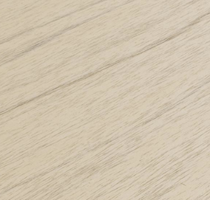

<iframe title="Adobe Video Publishing Cloud Player" width="854" height="480" src="https://video.tv.adobe.com/v/35156/?quality=12&learn=on)&marketingtech.adobe.analytics.additionalAccounts=tmdtmdaemdemoutilsprod" frameborder="0" webkitallowfullscreen 
mozallowfullscreen allowfullscreen scrolling="no"></iframe>

AEM Assets Dynamic Media 3D support re-imagines (and replaces) the AEM's 3D assets capability released as a AEM 6.4 Feature Pack. Use this instead!

Dynamic Media 3D support enables customers to deliver interactive 3D experiences to web properties and apps with simple one-click publishing and proven global scale.

Enterprise businesses are increasingly looking to use 3D assets in marketing experiences, however publishing and viewing these complex assets on the web typically requires custom development and is resource intensive to support. This creates a significant barrier of adoption for customers wanting to use this exciting content.

3D Support in Dynamic Media enables customers to publish and add 3D content to their pages or apps with just a few clicks. This is a 3-part feature:

+ Easy 1-click publishing of common 3D asset formats to generate a published URL
+ Inclusion of a new 3D Web Viewer in the Dynamic Media viewer library, powered by Adobe Dimension for interactive viewing of published 3D assets
+ AEM Sites WCM Component to easily use the 3D publishing and viewer in AEM Sites pages

## Supported file formats

+ [Adobe docs maintains the official list of supported 3D file formats.](https://docs.adobe.com/content/help/en/experience-manager-65/assets/using/previewing-3d-assets.html#supported-3d-previewing-assets)

## Demo 3d models

| Format | Type | Description | Download | Preview |
|--------|------|-------------|----------|---------|
| gLB, USDz | model | Armchair with wood, leather, and brass material | [Download](https://link.enablementadobe.com/3d-model-armchair) |  |
| gLB, USDz | model | Running Shoe | [Download](https://link.enablementadobe.com/3d-model-shoe) |  |
| OBJ, gLB, DN | model, scene | Hot-rod engine block with blower & headers | [Download](https://link.enablementadobe.com/3d-model-engine) |  |
| gLB, USDz, DN | model, scene | Race car | [Download](https://link.enablementadobe.com/3d-model-sports-car) |  |
| gLB, USDz, DN | model, scene | Soda can | [Download](https://link.enablementadobe.com/3d-model-pop-can) |  |
| sbsar | material | Substance material - Leather | [Download](https://link.enablementadobe.com/3d-model-leather-texture) |  |
| sbsar | material | Substance material - American Walnut | [Download](https://link.enablementadobe.com/3d-model-walnut-texture) |  |

You can also get free materials from [https://source.substance3d.com/](https://source.substance3d.com/) and free models from [https://stock.adobe.com/3D-assets](https://stock.adobe.com/3D-assets)

## How to Demo

### Pre-requisites:
+ AEM is 6.5.5.0 (Service Pack 5)  or Cloud Service version 2020.6 (June 18, 2020 Release) 
+ Dynamic Media is configured in DMS7 run-mode 
+ Dimensional viewer preset is published (see steps [here](https://docs.adobe.com/content/help/en/experience-manager-64/assets/dynamic/managing-viewer-presets.html#publishing-viewer-presets))

### Demo 1 - Publishing gLB to generate a 3D web experience
+ Upload gLB file to AEM Assets
+ Publish asset (use either "quick publish" or "manage publication"
+ Select "Viewers" in the side-bar dropdown
+ Select "Dimensional" viewer
+ Click "URL" button on lower left, copy URL that is shown in modal
+ Open a new browser window, paste URL
+ Interact with asset

### Demo 2 - Publishing USDz for iOS "Quicklook" AR experience
+ Upload USDz file to AEM Assets
+ Publish asset (use either "quick publish" or "manage publication"
+ Select "Renditions" in the side-bar dropdown
+ Select original
+ Click "URL" button on lower left, copy URL that is shown in modal
+ Open URL on iOS device, launch Quicklook
+ Interact with asset in 3D or AR

### Demo 3 - Using 3D Media component in a Sites page
+ Upload gLB file to AEM Assets
+ Publish gLB asset ("Quick Publish" is the fastest method)
+ Create or open a Sites page
+ Enable "3D Media" component, under Dynamic Media. See here for instructions on enabling Dynamic Media components
+ Using the component browser, drag "3D Media" component to page
+ Switch to asset view and filter for "3D"
+ Drag gLB asset onto the 3D Media component
+ Preview & interact with asset 
 
## Demos

* [Adobe Asset Link Demo](https://internal.adobedemo.com/content/demo-hub/en/demos/external/europa-creative-cloudinappexperience.html)
* [Adobe Asset Link Demo Video (#2)](https://www.adobe.com/marketing/experience-manager-assets/adobe-asset-link.html)

## Other materials

* [Adobe Asset Link Docs](https://www.adobe.com/creativecloud/business/enterprise/adobe-asset-link.html)
* [Adobe Pre-release Site](https://www.adobeprerelease.com/beta/12CD68B7-238C-47F0-A211-C86DCFB57145)
* [INTERNAL Adobe Only - FAQ](https://adobe.ly/2C5Dj5C)
* [INTERNAL Adobe Only - Adobe Asset Link with Dynamic Media](https://wiki.corp.adobe.com/display/~gklebus/Set+up+Europa+and+Dynamic+Media+on+AEM+6.4+L21) 
* [Adobe.com Marketing page](https://www.adobe.com/creativecloud/business/enterprise/adobe-asset-link.html)

